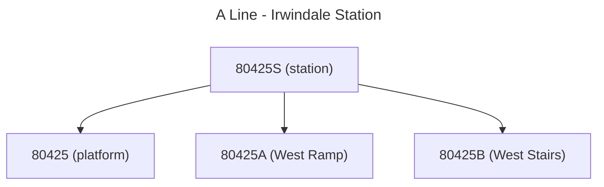

```mermaid
---
title: A Line - Irwindale Station
---
graph TD

station["80425S (station)"]
platform["80425 (platform)"]
station --> platform

ramp["80425A (West Ramp)"]
station --> ramp

stairs["80425B (West Stairs)"]
station --> stairs

```
