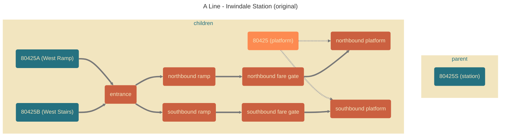

```mermaid
---
title: A Line - Irwindale Station (original)
---
graph TD

subgraph parent
    station("80425S (station)")
end

subgraph children
    platform("80425 (platform)")
    entrance("entrance")
    west-ramp("80425A (West Ramp)")
    west-stairs("80425B (West Stairs)")

    northbound-ramp("northbound ramp")
    northbound-fare-gate("northbound fare gate")
    northbound-platform("northbound platform")

    southbound-ramp("southbound ramp")
    southbound-fare-gate("southbound fare gate")
    southbound-platform("southbound platform")

    platform -.-> northbound-platform
    platform -.-> southbound-platform

    west-ramp --> entrance
    west-stairs --> entrance

    entrance --> northbound-ramp
    northbound-ramp --> northbound-fare-gate
    northbound-fare-gate --> northbound-platform

    entrance --> southbound-ramp
    southbound-ramp --> southbound-fare-gate
    southbound-fare-gate --> southbound-platform

end

linkStyle default stroke:#777,stroke-width:4px
linkStyle 0 stroke:#aaa,stroke-width:4px
linkStyle 1 stroke:#aaa,stroke-width:4px

classDef blue fill:#257180,stroke-width:0,color:#F2E5BF
classDef brown fill:#CB6040,stroke-width:0,color:#F2E5BF
classDef orange fill:#FD8B51,stroke-width:0,color:#F2E5BF
classDef cream fill:#F2E5BF,stroke-width:0,color:#257180

class station,west-ramp,west-stairs blue
class entrance,northbound-ramp,southbound-ramp,northbound-fare-gate,southbound-fare-gate,northbound-platform,southbound-platform brown
class platform orange

class parent,children cream

```
