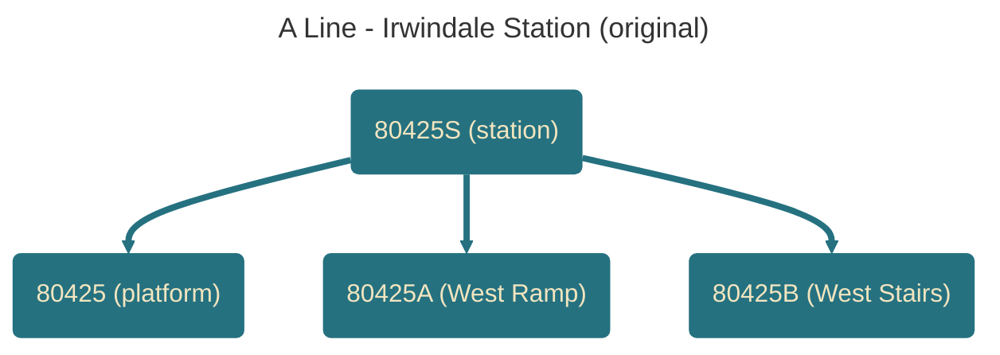

```mermaid
---
title: A Line - Irwindale Station (original)
---
graph TD

station("80425S (station)")
platform("80425 (platform)")
station --> platform

ramp("80425A (West Ramp)")
station --> ramp

stairs("80425B (West Stairs)")
station --> stairs

linkStyle default stroke:#257180,stroke-width:4px

classDef blue fill:#257180,stroke-width:0,color:#F2E5BF
class station,platform,ramp,stairs blue

```
